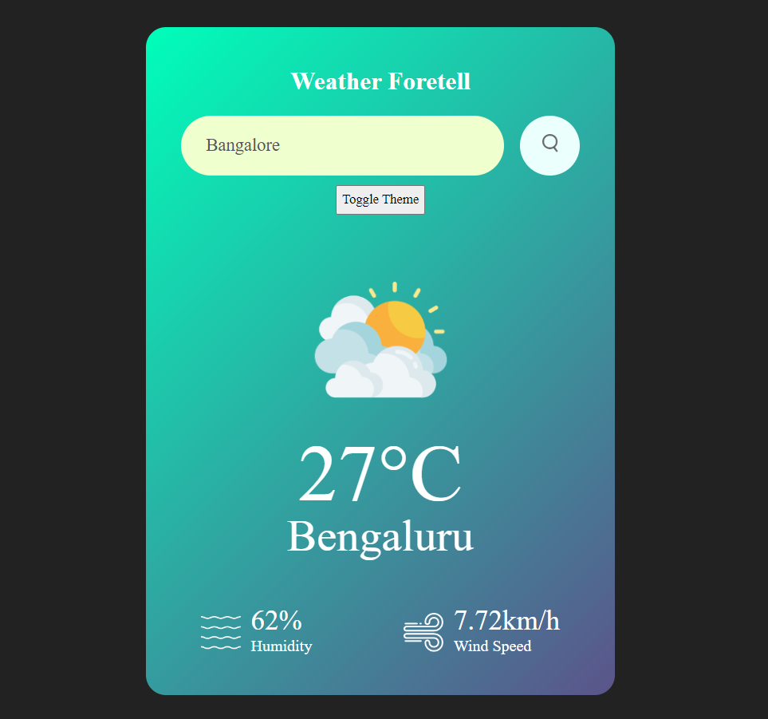
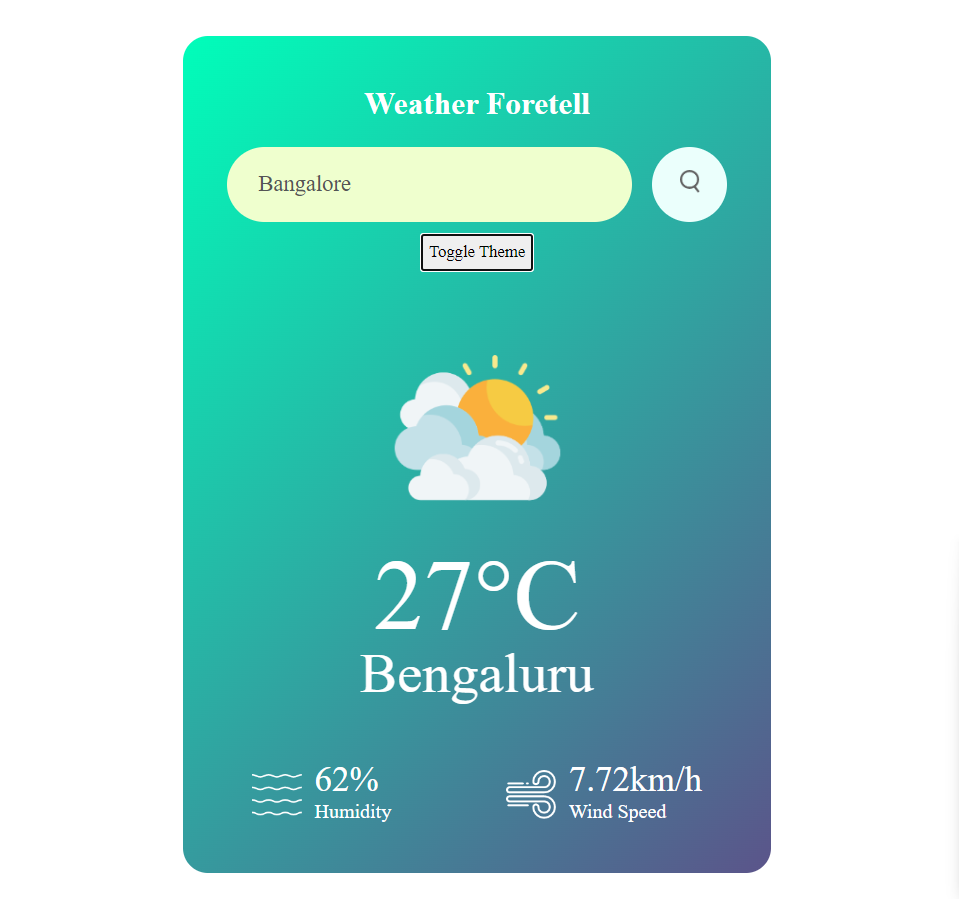
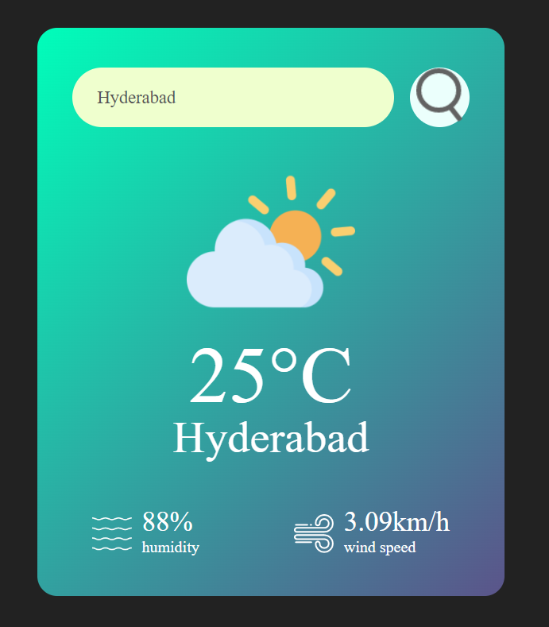
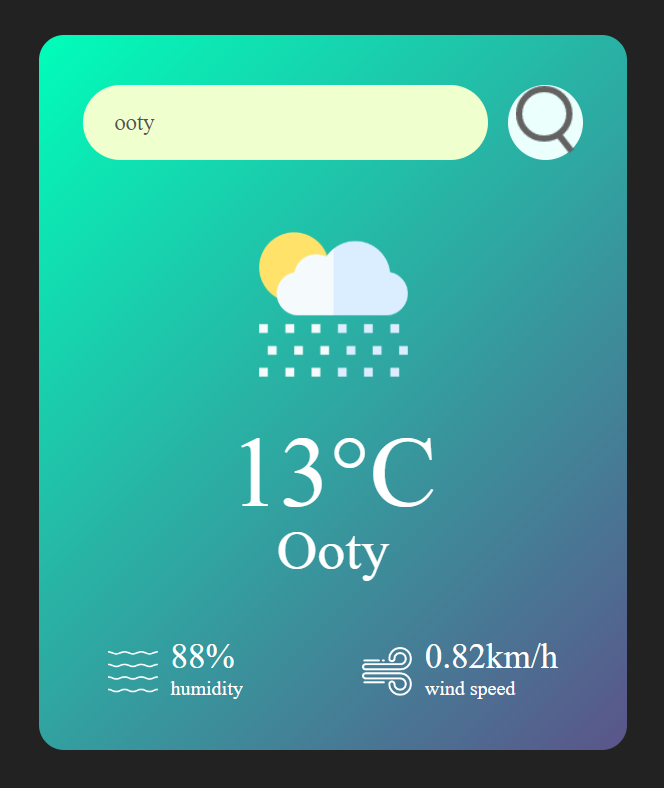

# Weather Foretell

Weather Foretell is a weather forecasting application that provides real-time weather updates based on user input. It features a clean, responsive design with options to toggle between light and dark themes.

## 📜 Overview

Weather Foretell allows users to enter a city name to receive current weather information, including temperature, humidity, and wind speed. The app utilizes the OpenWeatherMap API to fetch weather data and dynamically updates the interface based on the weather conditions.

## 🚀 Features

- **Real-Time Weather Data:** Fetches current weather information including temperature, humidity, and wind speed.
- **Dynamic Weather Icons:** Displays weather-specific icons based on conditions such as rain, clear skies, and clouds.
- **Light and Dark Themes:** Toggle between light and dark themes to suit user preferences.
- **Responsive Design:** Mobile-friendly design with adaptive layouts for various screen sizes.


## 🌗 Theme Toggle

Weather Foretell includes a theme toggle feature that allows users to switch between light and dark modes. This enhances usability in different lighting conditions and personal preferences.

### Light Theme


### Dark Theme



## 📸 Screenshots

Homepage


City




## 🎮 How to Use

1. **Search for Weather:**
   - Enter a city name in the search box and click the search button or press "Enter."
   - View current weather details and icons reflecting the weather conditions.

2. **Toggle Theme:**
   - Click the "Toggle Theme" button to switch between light and dark modes.

3. **View Weather Details:**
   - The app displays temperature, humidity, and wind speed for the entered city.

## 📁 Project Structure

###### weather-foretell/ 
###### │ 
###### ├── index.html     # Main HTML file 
###### ├── style.css      # Stylesheet for the application 
###### └── images/        # Directory containing weather icons


## 💻 Getting Started

To run Weather Foretell locally:

1. **Clone the Repository:**

   ```bash
   git clone https://github.com/yourusername/weather-foretell.git
2. **Navigate to the Project Directory:**

   cd weather-foretell

3. **Open the index.html file in a web browser:**

   You can do this by double-clicking the file or using a local server.

## 📝 License

This project is licensed under the MIT License. 
